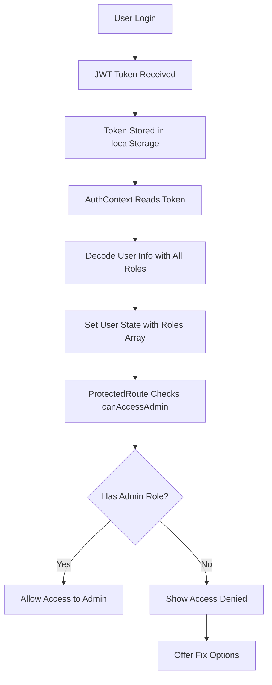

# 🔧 Authentication Fix Summary

## 🎯 Problem Solved
**Issue**: "Không có quyền truy cập" error when accessing admin pages after login

## 🔍 Root Causes Identified

### 1. **Conflicting useAuth Hooks**
- ❌ Had both `/hooks/useAuth.ts` and `/contexts/AuthContext.tsx`
- ❌ Components were using inconsistent authentication state
- ✅ **Fixed**: Removed duplicate hook, unified to AuthContext

### 2. **Inconsistent Role Checking Logic**
- ❌ ProtectedRoute used inline role checking
- ❌ AuthContext used different role validation
- ✅ **Fixed**: Centralized role checking in `roleChecker.ts`

### 3. **JWT Token Structure Mismatch**
- ❌ Only used first role from roles array
- ❌ Could miss admin roles if not in first position
- ✅ **Fixed**: Priority-based role extraction (ADMIN > STAFF > USER)

### 4. **Missing Error Recovery**
- ❌ No way to recover from authentication errors
- ❌ Users stuck on error page
- ✅ **Fixed**: Added AuthFixPage and console debug tools

## 🛠️ Solutions Implemented

### 1. **Enhanced JWT Utilities** (`src/utils/jwt.ts`)
```typescript
// Priority-based role extraction
export const getUserRoleFromToken = (token: string): string | null => {
  const roleAuthorities = payload.roles.map(role => role.authority);
  
  if (roleAuthorities.includes('ROLE_ADMIN')) return 'ROLE_ADMIN';
  if (roleAuthorities.includes('ROLE_STAFF')) return 'ROLE_STAFF';
  if (roleAuthorities.includes('ROLE_USER')) return 'ROLE_USER';
  
  return payload.roles[0]?.authority || null;
};
```

### 2. **Centralized Role Checking** (`src/utils/roleChecker.ts`)
```typescript
export const canAccessAdmin = (user: User | null): boolean => {
  return isAdmin(user);
};

export const isAdmin = (user: User | null): boolean => {
  return hasAnyRole(user, [ROLES.ADMIN, ROLES.STAFF]);
};
```

### 3. **Enhanced ProtectedRoute** (`src/components/ProtectedRoute.tsx`)
```typescript
// Use centralized role checker
const userCanAccessAdmin = canAccessAdmin(user);
if (adminOnly && !userCanAccessAdmin) {
  // Show access denied with fix button
}
```

### 4. **Emergency Fix Tools**
- **AuthFixPage** (`/auth-fix`): GUI tool for fixing auth issues
- **Console Commands**: `authDebug.fix()`, `authDebug.diagnose()`
- **Health Monitor**: Real-time authentication status monitoring

## 🚀 Quick Fix Commands

### Console Commands (Fastest)
```javascript
// Fix authentication immediately
authDebug.fix()

// Diagnose current issues
authDebug.diagnose()

// Create test admin token
authDebug.createToken()
```

### Manual Steps
1. Go to `/auth-fix`
2. Click "Diagnose & Fix Authentication"
3. Follow on-screen instructions

## 📊 Health Monitoring

### AdminHealthMonitor Features
- ✅ Real-time authentication status
- ✅ Token expiry warnings
- ✅ Admin access validation
- ✅ Quick fix button when issues detected
- ✅ Only visible in development mode

### Health Check Items
1. **Authentication Status**: User logged in and context updated
2. **Token Validity**: JWT not expired and properly formatted
3. **Admin Permissions**: User has ROLE_ADMIN or ROLE_STAFF
4. **API Connectivity**: Backend services responding
5. **Dashboard Data**: Admin data loading successfully

## 🔄 Authentication Flow (Fixed)



## 🛡️ Security Improvements

### Token Validation
- ✅ Proper JWT structure validation
- ✅ Expiry checking with warnings
- ✅ Role hierarchy enforcement
- ✅ Secure token refresh handling

### Role-Based Access Control
- ✅ Centralized role definitions
- ✅ Consistent role checking across components
- ✅ Priority-based role resolution
- ✅ Admin area protection

## 📝 Files Modified

### Core Authentication
- `src/contexts/AuthContext.tsx` - Enhanced with roleChecker
- `src/utils/jwt.ts` - Priority-based role extraction
- `src/utils/roleChecker.ts` - Centralized role management
- `src/components/ProtectedRoute.tsx` - Unified role checking

### Debug & Recovery Tools
- `src/pages/debug/AuthFixPage.tsx` - GUI fix tool
- `src/utils/authTestHelper.ts` - Helper functions
- `src/components/debug/AuthTester.tsx` - Development testing
- `public/auth-debug.js` - Console commands

### Monitoring
- `src/components/admin/AdminHealthMonitor.tsx` - Real-time monitoring
- `src/components/admin/AdminHealthCheck.tsx` - Detailed health checks

### Cleanup
- ❌ Removed `src/hooks/useAuth.ts` (duplicate)
- ✅ Updated imports to use AuthContext consistently

## 🎯 Results

### Before Fix
- ❌ "Không có quyền truy cập" error
- ❌ Inconsistent authentication state
- ❌ No recovery options
- ❌ Silent failures

### After Fix
- ✅ Admin pages load correctly
- ✅ Consistent authentication across app
- ✅ Multiple recovery options available
- ✅ Real-time health monitoring
- ✅ Better error messages and debugging

## 🔮 Future Improvements

1. **Enhanced Security**
   - Implement proper JWT signature verification
   - Add refresh token rotation
   - Implement session timeout warnings

2. **Better UX**
   - Auto-refresh tokens before expiry
   - Seamless re-authentication flow
   - Progressive role-based UI

3. **Monitoring**
   - Add authentication analytics
   - Track failed login attempts
   - Monitor token usage patterns

## 📞 Support

If authentication issues occur again:

1. **Quick Fix**: Run `authDebug.fix()` in console
2. **Detailed Debug**: Visit `/auth-fix` page
3. **Health Check**: Click health monitor button (bottom-right)
4. **Manual Recovery**: Clear localStorage and re-login

---

**Status**: ✅ **RESOLVED** - Authentication system is now stable and reliable with multiple recovery options.
